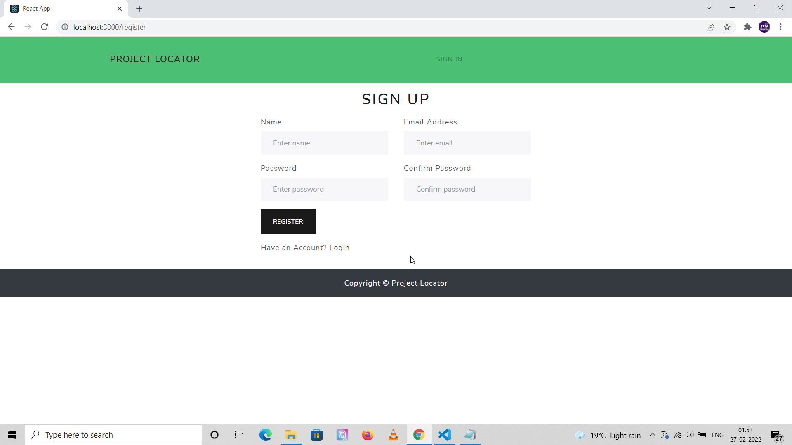
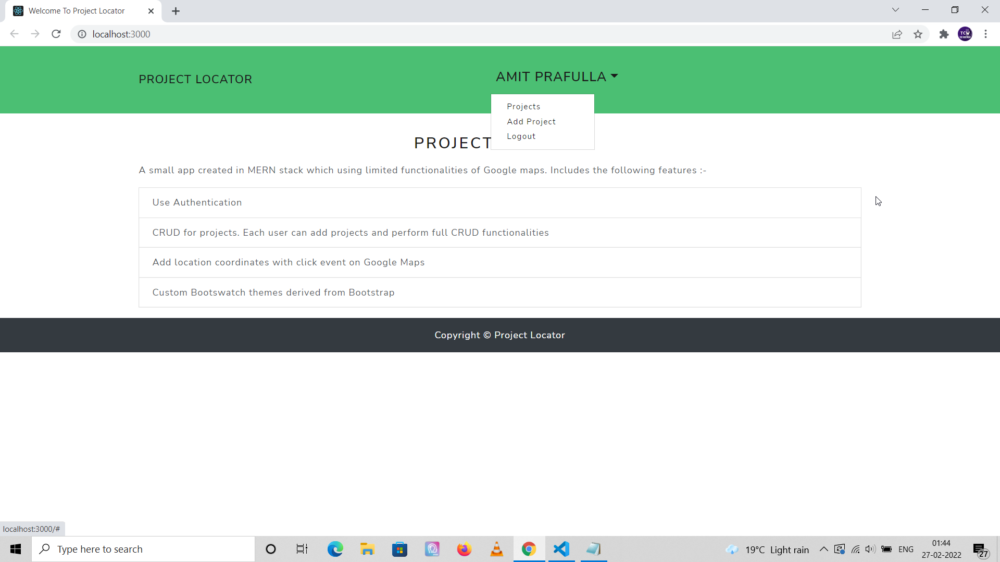
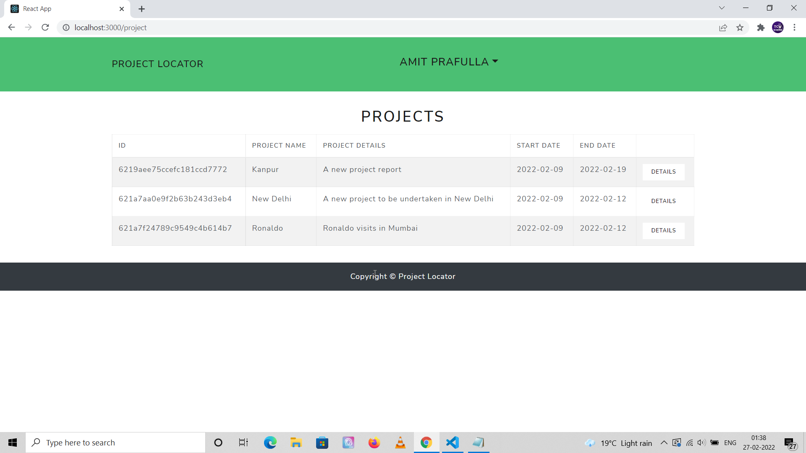
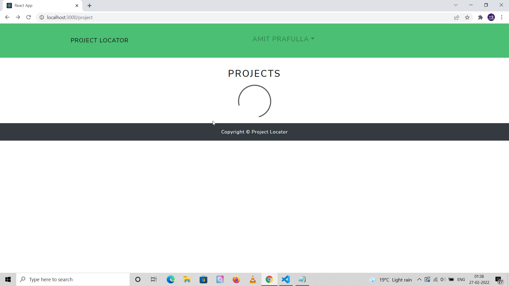
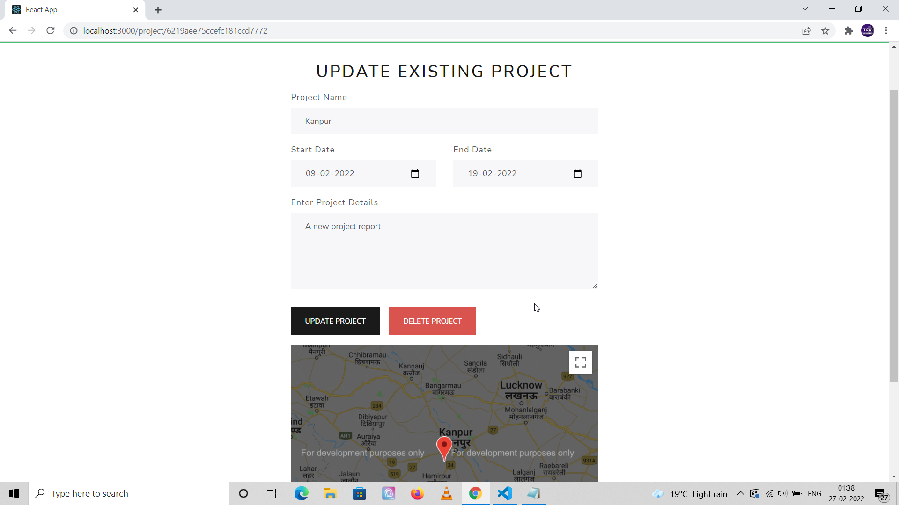

<h3 align="center">
  MERN Project Locator using Google Apps
</h3>

## Overview

- **Made in React.** A progressive modern front-end Javascript framework to build blazing fast SPA applications.

- **Express Backend API.** Contains back-end API written in Express with multi-user authentication and fully functional CRUD on
project module.

- **Google Maps Integration.** Elementary level integration of Google maps for development purpose only. It does have a click event on Google maps which would store and display the coordinates clicked from the MongoDB database. On front-end for Google
maps integration it uses a popular library called "React-google-maps".

- **Project Module.** After registration each user can add project. Each project would have details, location coordinates, start and end dates as attributes which can be modified through CRUD operations.

- **React Bootstrap.** Uses React Bootstrap for grid, button, cards and other components.

## Development Setup

Please install node modules through npm install command, contains separate front-end and back-end sections.

```
npm install

// For making a build and deploying for production
npm run build

// For development
npm start

```

Concurrently and Nodemon packages are being used to run both frontend and back-end React and Express apps simultaneously.

```
npm run dev
```
## Future improvements

- Might do some code refactoring, for instance might add a separate interceptor file to make API calls.

- Might integrate geo-coder API which would automatically detect the name of the location clicked on the Google maps.

### Update 6/3/2022

- Google Authentication added to the project on experimental basis. Meaning, you can test Google login functionality, but the 
back-end of the application is still not configured to serve APIs using Google ID and username

- Following steps were take to implement Google Auth in this app.

* "React-google-login" 3rd party package is being used. This would be used to display "Login with Google" button.

* Go to Google console developer and create a new application

* Choose this app and go to OAuth Consent Screen, give a unique name to the app for Google to uniquely identify your
application.

* Go to create credentials --> OAuth Client ID, fill in Authorized Origin and Authorized Redirect Url fields.

* Paste this Client ID in this app as a prop passed to "React-Google-Login" component.

## Project Screenshots

Screenshots would be added as development is in progress. Below is the attached screenshot of the sign-up page.



This is how homepage of the app looks like with feature list.



Add a project page with Google maps



A simple spinner loader used in the application



Update existing project in the application




## Estimated Completion Time

The project is expected to be completed in around 1 week.
